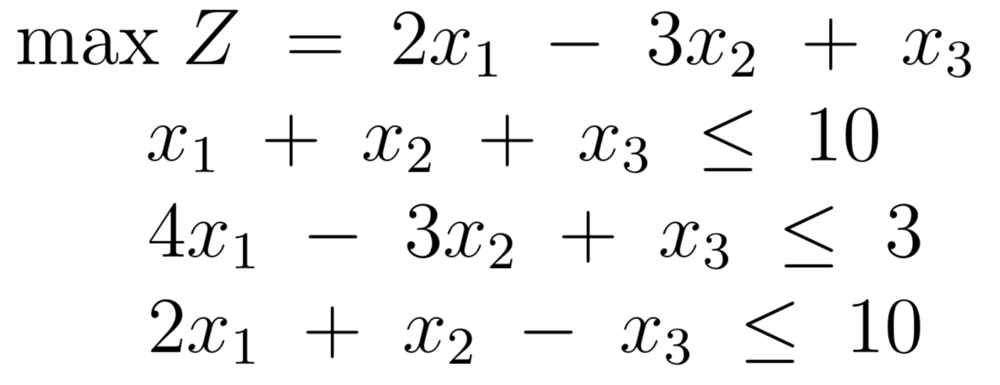

# A Library of Simplex Method Solvers (LoSMS) Source Code

##Dependencies

The following has to be installed to run LoSMS:

1. Python3
2. pip ()

```sh
$ sudo apt-get install python3-pip
```
3. NumPy ()

```sh
$ sudo apt-get install python3-numpy
```

##Run LoSMS

The syntax for running LoSMS is:

```sh
$ python3 Driver.py -lc "[[a1,a2,...],[b1,b2,...],...]" -const "[k1,k2,...]" -ob "[x1,x2,...]" -g "max/min"
```

Where:

- lc = the coefficients of the linear constraints
- const = the constants (Ax <= const)
- ob = the coefficients of the objective function
- g = the goal (max or min)

##Example

To solve the following linear program:

<p align="center">

</p>

Run:

```sh
$ python3 Driver.py -lc "[[1,1,1],[4,-3,1],[2,1,-1]]" -const "[10,3,10]" -ob "[2,-3,1]" -g "max"
```


